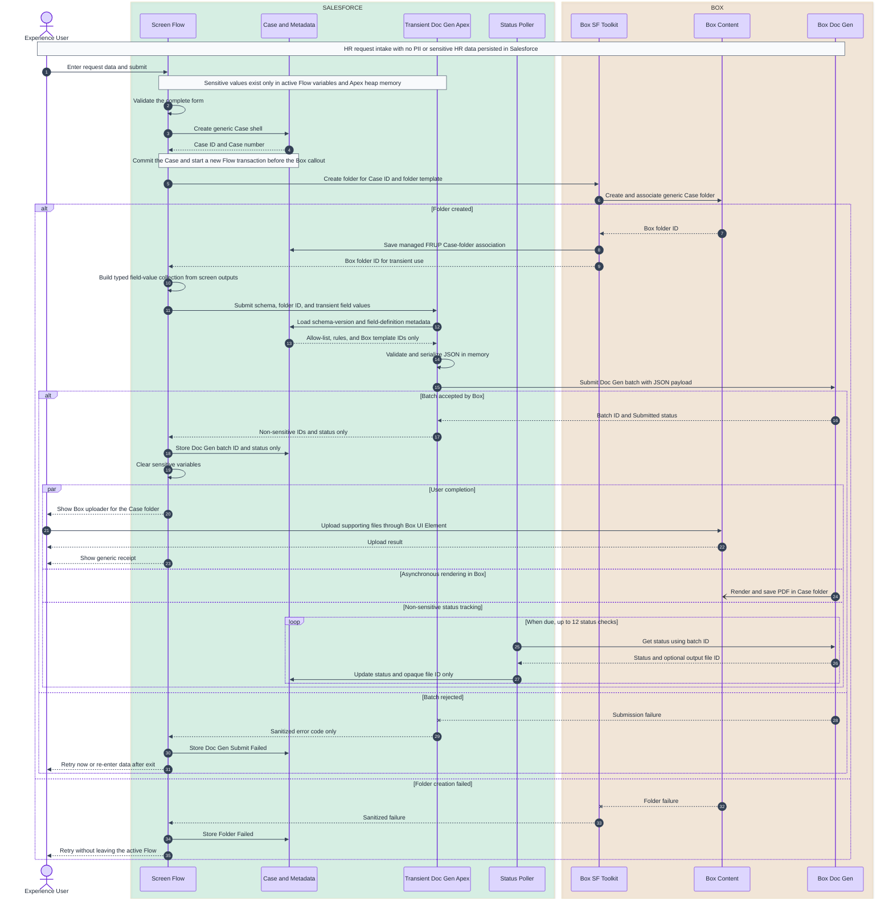

# Salesforce Case Intake and Box Doc Gen

## Summary

Build an authenticated Experience Cloud Screen Flow for the New Hire/Rehire intake represented in `/Users/jkoepp/Downloads/New Hire Smartsheet AMH 8.18.pdf`. The Flow will collect request data transiently, create a non-sensitive Case shell, synchronously create the Case's Box folder, submit an asynchronous PDF Doc Gen job using an in-memory JSON payload, and then present the Box uploader.

Salesforce must not persist request-subject PII or sensitive HR data. This includes names, employee identifiers, SSNs, birth dates, addresses, email addresses, compensation, certification details, notes, the complete form payload, and values derived from those fields. No custom Salesforce object will store request data. Box is the system of record for the generated document and supporting files.

The design uses Box for Salesforce 5.53 already installed in the org. Box's native record-based Doc Gen action will not be used because there is deliberately no Salesforce record containing the merge data. A schema-neutral Apex action will construct the payload in memory and call `box.DocGenToolkit.submitDocGenBatch`, which supports arbitrary JSON input through the [Box Doc Gen batch API](https://developer.box.com/guides/docgen/generate-document).

## Data Residency and Persistence Boundary

### Prohibited in Salesforce

The following must never be written to a Salesforce record, Salesforce File, Note, Task, Platform Event, Platform Cache entry, paused Flow interview, async Apex job, debug log, integration log, exception message, or Flow error email:

- Any form-entered request-subject identity or contact value.
- SSN, birth date, address, email, employee ID, salary, pay rate, certification number, or sensitive notes.
- The complete JSON payload or any fragment containing a sensitive value.
- Uploaded supporting documents or generated document content.
- A generated filename containing the request subject's name or another sensitive value.

Do not use Queueable, Batch, Future, Scheduled Apex, Platform Events, or another serialized Salesforce mechanism to carry the payload. Box Doc Gen processing can be asynchronous only after the payload has been synchronously accepted by Box.

### Permitted in Salesforce

Salesforce may retain only non-sensitive orchestration metadata:

- Case ID and Case number.
- Generic request type, schema key/version, integration status, attempt count, and timestamps.
- Opaque Box folder, Doc Gen batch, and output file IDs.
- Sanitized error codes that contain no request values or Box response body.
- Standard authenticated-user audit fields required by Salesforce, such as `CreatedById`.
- Box managed-package folder-association records, provided they contain only Salesforce and Box identifiers and no request data.

Operational reporting in Salesforce is therefore limited to request counts, processing state, timestamps, and integration failures. Reporting on the employee, compensation, certifications, or other form values must occur in the approved HR system or Box, not Salesforce.

## Implementation Changes

### End-to-end Flow

1. Add a New Hire/Rehire Screen Flow to Experience Cloud with standard screen components covering:
   - Employee identity and contact fields.
   - Region, district, station, start date, rehire status, title, dual role, department, manager, and employment status.
   - Certification details, compensation category/reason, and notes.
   - Submitter attestation.
2. Keep all entered values in active Flow variables only. Disable Pause, Wait, save-for-later, resume, and input/output variable exposure. Do not place a screen, asynchronous action, or logging action between payload assembly and Doc Gen submission.
3. Limit v1 to New Hire/Rehire. Other request types become separate Screen Flows that reuse the same transient Apex interface.
4. On submit:
   - Validate all fields before any record creation.
   - Create a Case shell with a generic subject such as `HR Request`, generic Type/Origin/Status values, and no Description or form-derived values.
   - Mark the Case as intake-managed using a non-sensitive provisioning field.
   - Call `box__CreateFolderForRecordIdFromTemplate_v2` with the Case ID and configured folder-template ID. Use a generic Box folder name based only on the Case number.
   - Configure the folder action to start a new Flow transaction so the Case is committed before the Box callout, as supported by [Salesforce Flow transaction control](https://help.salesforce.com/s/articleView?id=flow_concepts_transaction.htm&language=en_US).
   - Let the Box managed package persist the Case-to-folder association in `box__FRUP__c`. Keep the folder ID returned by the action only in an active Flow variable for the immediate Doc Gen and uploader steps; do not copy it to a Case field.
   - Immediately call `SubmitTransientCaseDocGen`. The Apex action validates the transient field collection, constructs JSON in memory, submits it to Box, and returns only non-sensitive job identifiers and status.
   - Update the Case with only the Doc Gen batch ID, status, output file ID when available, and sanitized error code. The folder relationship remains owned by the Box managed package.
   - Clear sensitive Flow variables after the action returns and before rendering the upload or receipt screen.
5. Show the managed Box Content Uploader on the next Flow screen with the returned folder ID. Files go directly to Box; no Salesforce `ContentVersion` or other staging record is created.
6. Show a receipt containing only the Case number and non-sensitive integration status. Do not echo the request subject's name, email, compensation, or other form values.
7. Add Box Content Explorer to the Experience Cloud Case page with preview, upload, and download enabled; disable delete, rename, share, and folder creation. The supported component properties are documented in [Box UI Elements for Salesforce](https://developer.box.com/guides/tooling/salesforce-toolkit/ui-elements).

### Transient form construction and Apex handoff

#### Recommended v1 pattern

Use standard Screen Flow components for the fixed New Hire/Rehire form. A custom LWC is not required for v1, and there is not a separate Apex action for every field. Salesforce makes each screen component's entered value available as a Flow resource after the user leaves the screen. Flow Assignment elements package those resources into a typed, in-memory collection, and one `SubmitTransientCaseDocGen` Apex action receives the complete collection. Salesforce documents both [screen components as Flow resources](https://help.salesforce.com/s/articleView?id=sf.flow_ref_resources.htm&language=en_US&type=5) and the use of [Assignment elements to populate collections](https://help.salesforce.com/s/articleView?id=flow_ref_resources_variable_populate.htm&language=en_US&type=5).

Use this runtime sequence:

1. Render the form with standard Text, Email, Date, Checkbox, Picklist, and Text Area components. Prefer one sensitive-data screen with Sections so the values do not cross more screen boundaries than necessary.
2. Give every component a stable API name, such as `inEmployeeFirstName`, `inStartDate`, and `inCurrentCompensation`. Do not mark any PII/HR variable as available for input or output outside the Flow.
3. When the user submits the screen, run Flow formulas and Decisions for cross-field rules. Explicitly blank values from fields that became inapplicable after a controlling choice changed so hidden stale values are not sent.
4. Create the generic Case and Box folder. Do not assemble the payload collection until the folder action succeeds and the Flow has the destination folder ID.
5. Run a small group of Assignment elements named by section, such as `Build_Employee_Fields`, `Build_Assignment_Fields`, `Build_Certification_Fields`, `Build_Compensation_Fields`, and `Build_Submitter_Fields`. These are in-memory Flow operations, not Apex actions or database writes.
6. Each Assignment initializes one or more `DocGenFieldValue` Apex-defined variables from screen resources and adds them to the `colDocGenFields` Apex-defined collection.
7. Invoke `SubmitTransientCaseDocGen` once, passing the Case ID, transient folder ID, fixed schema key/version, and `colDocGenFields`.
8. Apex validates every path and type against custom metadata, creates the nested JSON with `JSON.serialize`, and submits it to Box. Flow never constructs JSON itself.
9. After Apex returns, retain only the batch ID and sanitized status. Clear assignable sensitive variables and the field-value collection, proceed directly to the non-sensitive upload/receipt screen, and allow the Flow interview to finish.

No Screen, Pause, Wait, save-for-later step, asynchronous action, subflow boundary, or logging action is permitted between `Build_*_Fields` and `SubmitTransientCaseDocGen`.

#### Flow resources

Create these resources in the Screen Flow:

| Resource | Flow type | Purpose |
| --- | --- | --- |
| `cSchemaKey` | Text constant: `newHire` | Selects an allow-listed schema; never user-entered |
| `cSchemaVersion` | Text constant: `1.0` | Selects the exact schema version; never user-entered |
| `vCaseId` | Text/ID variable | Generic Case shell ID |
| `vBoxFolderId` | Text variable | Folder ID returned by the Toolkit; transient in Flow |
| `fv...` variables | Apex-defined `DocGenFieldValue` | Typed descriptor for each form value |
| `colDocGenFields` | Apex-defined collection of `DocGenFieldValue` | Complete transient value set passed to the single Apex action |
| `vDocGenBatchId` and `vDocGenStatus` | Text variables | Non-sensitive outputs returned by Apex |

All availability-for-input/output flags remain disabled except where a non-sensitive launcher input such as an existing authorized failed Case ID is explicitly required.

`DocGenFieldValue` is a top-level Apex-defined type with an accessible no-argument constructor and Flow-visible properties. Salesforce supports Apex-defined variables and collections whose fields use supported primitive types. See [Apex-defined Flow data types](https://help.salesforce.com/s/articleView?id=platform.flow_concepts_apex_type.htm&language=en_US&type=5) and [supported Flow/LWC data types](https://developer.salesforce.com/docs/platform/lwc/guide/use-flow-data-types).

Use this logical structure:

```text
DocGenFieldValue
  path: String
  valueType: String        // text, date, number, or boolean
  textValue: String
  dateValue: Date
  numberValue: Decimal
  booleanValue: Boolean
```

Exactly one typed value property is populated for an entry. For example, `employee.firstName` uses `textValue`, `assignment.startDate` uses `dateValue`, and `assignment.dualRole` uses `booleanValue`. Apex treats `path` and `valueType` as untrusted input and verifies both against the selected schema metadata before using the value.

An Assignment element can contain multiple ordered rows. A representative employee-field assignment is:

```text
fvEmployeeFirstName.path       = "employee.firstName"
fvEmployeeFirstName.valueType  = "text"
fvEmployeeFirstName.textValue  = {!inEmployeeFirstName}
colDocGenFields                Add {!fvEmployeeFirstName}

fvStartDate.path               = "assignment.startDate"
fvStartDate.valueType          = "date"
fvStartDate.dateValue          = {!inStartDate}
colDocGenFields                Add {!fvStartDate}
```

Use a distinct `fv...` resource for each field rather than repeatedly mutating and clearing one shared Apex-defined variable. This makes the mapping auditable in Flow Builder and avoids ambiguity about whether an item already added to the collection could be affected by later assignments.

#### New Hire/Rehire mapping

The v1 Flow uses the following mapping from the attached sample form. These paths are stable contract names, not Salesforce fields.

| Sample form field | Example Flow component | Doc Gen path | Value type |
| --- | --- | --- | --- |
| Employee ID # | `inEmployeeId` | `employee.employeeId` | text |
| Employee First Name | `inEmployeeFirstName` | `employee.firstName` | text |
| Employee Last Name | `inEmployeeLastName` | `employee.lastName` | text |
| Today's Date | Formula using `$Flow.CurrentDate` | `request.requestDate` | date |
| Notification Type | Constant `newHireRehire` | `request.notificationType` | text |
| New Region | `inRegion` | `assignment.region` | text |
| New District | `inDistrict` | `assignment.district` | text |
| New Station/Corporate Location | `inStation` | `assignment.station` | text |
| Hire Date/Start Date | `inStartDate` | `assignment.startDate` | date |
| Rehire? | `inIsRehire` | `assignment.isRehire` | boolean |
| New Primary Title | `inPrimaryTitle` | `assignment.primaryTitle` | text |
| Dual role? | `inIsDualRole` | `assignment.isDualRole` | boolean |
| New Department | `inDepartment` | `assignment.department` | text |
| New Status | `inNewStatus` | `assignment.status` | text |
| New Manager | `inManager` | `assignment.manager` | text |
| Full Time/PRN Status | `inEmploymentStatus` | `assignment.employmentStatus` | text |
| Certification Level | `inCertificationLevel` | `certification.level` | text |
| TXDSHS Certification # | `inTxdshsCertificationNumber` | `certification.txdshsNumber` | text |
| Prior Certification #/State | `inPriorCertificationDetails` | `certification.priorStateDetails` | text |
| Current Hourly/Salary | `inCurrentCompensation` | `compensation.currentHourlyOrSalary` | text or number, fixed by schema metadata |
| New Hire Rate Reason | `inRateReason` | `compensation.rateReason` | text |
| Notes | `inNotes` | `notes` | text |
| Person Completing Form | `inSubmitterName` | `submitter.name` | text |
| Submitter Job Title | `inSubmitterJobTitle` | `submitter.jobTitle` | text |
| Submitter Email Address | `inSubmitterEmail` | `submitter.email` | text |
| Authorized/accurate attestation | `inAttestation` | `submitter.attested` | boolean |

The upload control is not part of this collection; supporting files go directly to Box after folder creation. Do not reproduce the sample form's “Send me a copy of my responses” behavior in v1 because that would create another copy of the sensitive response outside the approved Box workflow. A generic receipt with Case number and status is sufficient unless HR/privacy approves a separate secure-delivery design.

The sample does not display SSN, birth date, or home address, but future approved fields use the same typed-entry mechanism. Adding an allowed path to custom metadata and mapping a new screen resource does not create a Salesforce field or persisted request object.

#### Apex action input

The Flow configures one Apex Action element with this logical request:

```text
SubmitTransientCaseDocGen.Request
  caseId          = {!vCaseId}
  boxFolderId     = {!vBoxFolderId}
  schemaKey       = {!cSchemaKey}
  schemaVersion   = {!cSchemaVersion}
  fieldValues     = {!colDocGenFields}
```

The invocable method receives the platform-required list of request wrappers and returns one result per request. Its result contains only `batchId`, normalized `status`, and sanitized `errorCode`. Starting with API version 66.0, custom Apex classes used as invocable action parameters require an accessible no-argument constructor; the DTO classes must satisfy that requirement. See [Salesforce's Apex Action reference](https://help.salesforce.com/s/articleView?id=platform.flow_ref_elements_apex_invocable.htm&language=en_US&type=5).

Do not build the outbound JSON with a Flow Text Template, string concatenation, or an LWC-provided JSON string. Those approaches lose type fidelity, make escaping and null handling fragile, and move schema enforcement outside Apex. The Flow passes typed values; Apex alone creates the JSON.

#### When an LWC would be required

An LWC becomes appropriate in either of these cases:

- The form must be rendered dynamically from schema configuration instead of being an admin-maintained, fixed Screen Flow.
- Privacy policy concludes that values cannot reside even in an active, non-paused Flow interview across screen requests. In that stricter interpretation, use a custom form/orchestrator LWC that keeps sensitive values in private JavaScript memory and calls the staged Apex operations directly.
- The form requires repeatable rows, sophisticated reactive validation, or a user experience that standard Flow components cannot provide.

A Flow-screen LWC that simply exposes every field as an output does not materially tighten the privacy boundary because Flow still receives and holds those outputs. To reduce Flow state, the LWC must keep the sensitive properties private, invoke Apex itself after local validation, and return only non-sensitive Case/batch/status values to Flow. It must not use browser local storage, session storage, URL parameters, Lightning Data Service record cache, console logging, or client telemetry for request data.

That LWC path also owns the multi-transaction orchestration: create the generic Case, create/associate the Box folder, then submit the sensitive Doc Gen request. It is substantially more custom code and testing than the standard Flow pattern, so it is not recommended for v1 unless the stricter privacy interpretation applies.

### UML sequence diagram

#### Mermaid diagram



#### ASCII fallback

```text
┌──────────────┐  ┌──────────────────┐  ┌──────────────┐  ┌──────────────┐
│ Experience   │  │ Salesforce       │  │ Box Content  │  │ Box Doc Gen  │
│ User         │  │ Flow/Apex/Case   │  │ + Toolkit    │  │              │
└──────┬───────┘  └────────┬─────────┘  └──────┬───────┘  └──────┬───────┘
       │ 1. Submit form     │                   │                 │
       │───────────────────>│                   │                 │
       │                    │ 2. Validate;      │                 │
       │                    │ create generic    │                 │
       │                    │ Case; commit      │                 │
       │                    │                   │                 │
       │                    │ 3. Create folder  │                 │
       │                    │──────────────────>│                 │
       │                    │ 4. FRUP mapping + │                 │
       │                    │ transient folder ID                │
       │                    │<──────────────────│                 │
       │                    │                   │                 │
       │                    │ 5. Send transient JSON payload      │
       │                    │────────────────────────────────────>│
       │                    │ 6. Batch ID/status only             │
       │                    │<────────────────────────────────────│
       │                    │ 7. Store Doc Gen IDs/status;        │
       │                    │    clear sensitive variables        │
       │                    │                   │                 │
       │ 8. Generic receipt │                   │                 │
       │<───────────────────│                   │                 │
       │ 9. Direct upload   │                   │                 │
       │───────────────────────────────────────>│                 │
       │                    │                   │ 10. Render PDF  │
       │                    │                   │<────────────────│
       │                    │ 11. Poll by batch ID; store status  │
       │                    │<────────────────────────────────────│
```

Diagram notes:

- The privacy boundary is the synchronous Doc Gen submission: sensitive request values cross from transient Salesforce runtime memory to Box but are never committed to Salesforce storage or serialized into Salesforce asynchronous work.
- Case creation and Box folder creation are separated by a Flow transaction boundary because the managed Box action requires a committed Case ID.
- `box__FRUP__c` is the single persisted Case-to-folder mapping. The folder ID returned to the Flow is transient and is not duplicated on Case.
- Retries can reuse the in-memory values only while the Flow remains active. After exit, the user must re-enter the request data; the saved generic Case contains nothing from which to reconstruct it.

### Transaction and failure behavior

- Folder creation must complete before Doc Gen submission so the destination folder ID is available.
- Doc Gen submission is synchronous from Salesforce's perspective: the active user request waits only until Box accepts the batch. Document rendering then continues asynchronously inside Box.
- If folder creation fails, retain the generic Case with `Folder Failed`, show a sanitized error, and allow an immediate retry without leaving the active Flow.
- If Box does not accept the Doc Gen batch, retain the generic Case with `Doc Gen Submit Failed` and allow an immediate retry while transient values remain available.
- If the user exits after submission failure, the payload is intentionally unrecoverable. A retry action must ask the user to re-enter all request data while reusing the authorized failed Case shell.
- Once Box returns a batch ID, the status poller uses only that ID and the Case ID because neither contains request data. The poller must never receive or reconstruct the payload.

### Doc Gen status poller

#### Purpose and boundary

`submitDocGenBatch` confirms that Box accepted the generation request; it does not mean the PDF is finished. Box renders the document asynchronously, so the Screen Flow should end without waiting for completion. The poller later calls `box.DocGenToolkit.getDocGenBatch(batchId)`, which Box documents as the method for retrieving batch status and generated-file details. Expected Box states are `pending`, `processing`, `completed`, and `failed`. See [Box Doc Gen Toolkit batch management](https://developer.box.com/guides/tooling/salesforce-toolkit/doc-gen-toolkit/#batch-management-methods).

The poller is privacy-safe because its input is limited to the Case ID and opaque Box batch ID. It does not query `box__FRUP__c`, retrieve the generated document, access the original merge payload, or reconstruct any form values.

#### Execution model

1. `SubmitTransientCaseDocGen` saves the returned batch ID, sets `HR_Integration_Status__c` to `Doc Gen Submitted`, records the submission time, and sets the first poll time to five minutes later.
2. A single `DocGenStatusScheduler` class implements `Schedulable` and runs every five minutes under a dedicated integration user.
3. The scheduler checks for an already-running `DocGenStatusBatch` and exits if one exists. This prevents overlapping jobs from polling or updating the same Cases.
4. If no batch is active, the scheduler starts `DocGenStatusBatch`, implemented with `Database.Batchable<SObject>` and `Database.AllowsCallouts`. A small, configurable scope such as 20 Cases keeps each transaction safely below callout limits.
5. The batch selects only Cases that have:
   - `Doc Gen Submitted` or `Doc Gen Processing` status.
   - A nonblank `Box_DocGen_Batch_Id__c`.
   - `HR_DocGen_Next_Poll_At__c` at or before the current time.
   - A poll count and elapsed time below the configured limits.
6. For each Case in the scope, the batch calls `box.DocGenToolkit.getDocGenBatch(batchId)`. It performs all Box callouts before Case DML.
7. Before applying results, the batch locks and rereads the affected Cases. It updates a Case only if the batch ID is unchanged and the Case is still nonterminal. This makes a scheduler run safe alongside an authorized manual refresh.
8. The batch performs partial-success DML so one Case update failure does not roll back unrelated status results.

The scheduled and batch jobs serialize only class configuration and Salesforce record IDs. They must never accept a payload-bearing object, transient form value, generated filename, or Box response body as constructor state.

#### Status mapping

| Box result | Salesforce action | Poll again? |
| --- | --- | --- |
| `pending` | Keep `Doc Gen Submitted`; increment poll count and set the next poll time | Yes, in five minutes |
| `processing` | Set `Doc Gen Processing`; increment poll count and set the next poll time | Yes, in five minutes |
| `completed` with output details | Set `Completed`; save only the output file ID/version ID and completion timestamp | No |
| `failed` | Set `Doc Gen Failed`; save an allow-listed error code, never Box's raw reason | No; manual resubmission requires re-entry of request data |
| HTTP 400, 403, or 404 | Set `Doc Gen Failed` with a sanitized configuration/access code | No; administrator action is required |
| HTTP 429, timeout, or Box 5xx | Keep the current nonterminal status and set a sanitized transient-error code | Yes, with 10-, 20-, then 30-minute capped backoff |
| No terminal result by the configured limit | Set `Timed Out` | No; route for administrator review |

Use a default ceiling of 12 poll attempts and two hours elapsed since submission. Store these values in custom metadata so operations can tune them without code changes. A `completed` response without an output file ID should be retried briefly and then converted to `Doc Gen Failed` with `DOCGEN_OUTPUT_MISSING`; it must not be treated as a successful completion.

#### Error handling and observability

- Convert Box failures into a small allow-list such as `DOCGEN_STATUS_FORBIDDEN`, `DOCGEN_STATUS_NOT_FOUND`, `DOCGEN_RATE_LIMITED`, `DOCGEN_STATUS_UNAVAILABLE`, and `DOCGEN_OUTPUT_MISSING`.
- Do not persist or log `DocGenResponse.error`, `mostRecentError`, HTTP response bodies, exception messages, or stack traces from managed-package calls. These values may contain filenames or other contextual data.
- Track counts by sanitized status, scheduler/batch success, elapsed time, and oldest outstanding submission. These metrics contain no HR request content.
- Create a list view or report for Cases in `Doc Gen Failed` or `Timed Out`. An optional record-triggered Flow may send a generic completion/failure notice containing only the Case number and status.
- Provide an administrator-only manual status-refresh action that reuses the same status service. It must enforce Case access and must not support resubmitting or reconstructing the original payload.

#### Why custom Apex instead of only Flow

The Box managed package exposes `getDocgenBatch` as a Flow action, so a purely declarative proof of concept can retrieve one batch status. The production poller remains custom Apex because it needs a sub-hour recurring schedule, bulk candidate selection, controlled callout scope, overlap protection, per-Case error classification, backoff, row-level concurrency checks, partial-success updates, and centralized log sanitization. Flow remains appropriate for an optional manual refresh or generic notification after Apex updates the Case.

For high volume or near-real-time completion, Box also supports Doc Gen webhooks for generation started, succeeded, and failed events. That alternative requires a secured inbound endpoint or middleware, signature validation, idempotency, and the same no-PII logging rules. It is not part of the v1 demo; the outbound-only poller has fewer infrastructure prerequisites. See [Box Doc Gen webhook events](https://developer.box.com/guides/docgen/docgen-getting-started/#use-webhooks).

### Declarative versus custom work

| Capability | Implementation |
| --- | --- |
| Form screens and validation | Screen Flow with transient variables only |
| Non-sensitive Case shell | Standard Case plus limited orchestration fields |
| Case Box folder creation | Existing Box managed-package Flow action |
| Direct supporting-document upload | Managed Box Content Uploader |
| Case folder browsing | Managed Box Content Explorer |
| Fixed New Hire/Rehire form rendering | Standard Screen Flow components; no custom LWC in v1 |
| Transient value assembly | Flow Assignment elements plus Apex-defined `DocGenFieldValue` variables/collection |
| Schema definition and version selection | Two Custom Metadata Types plus source-controlled metadata records; definitions contain no request values |
| Schema validation and JSON construction | Custom schema-neutral Apex, in memory only |
| Box-template/schema compatibility check | Custom deployment test or administrator validation action using the Box template-tags endpoint |
| Arbitrary-payload Doc Gen submission | Custom Apex wrapper around `box.DocGenToolkit` |
| Read one Doc Gen batch status | Managed `box.DocGenToolkit.getDocGenBatch`; also exposed as a Box Flow action |
| Recurring poll schedule and overlap prevention | Custom `DocGenStatusScheduler` Apex plus one configured scheduled job |
| Poll candidate selection and Box callouts | Custom `DocGenStatusBatch` Apex with `Database.AllowsCallouts`, using only Case and batch IDs |
| Status mapping, retry/backoff, concurrency, and sanitization | Custom reusable `DocGenStatusService` Apex |
| Manual status refresh | Optional Screen Flow or quick action invoking the same custom status service |
| Generic completion/failure notification | Optional record-triggered Flow after a terminal Case status update |
| Dynamic or client-state-only form rendering | Custom LWC only if later required by schema-driven UX or stricter privacy policy |

Modify the existing `Create_Box_Folder_for_New_Case` record-triggered Flow to exclude Cases marked as intake-managed, preventing it from racing with the synchronous folder creation in this Screen Flow.

## Interfaces and Salesforce Data Model

### Case orchestration fields

Do not create `Case_Intake_Submission__c` or any replacement object that stores request data. Add only the following non-sensitive fields to Case where an equivalent does not already exist:

- `HR_Request_Schema_Key__c` and `HR_Request_Schema_Version__c`.
- `HR_Integration_Status__c` with `Case Created`, `Folder Ready`, `Doc Gen Submitted`, `Doc Gen Processing`, `Completed`, `Folder Failed`, `Doc Gen Submit Failed`, `Doc Gen Failed`, and `Timed Out`.
- `HR_Intake_Managed_Provisioning__c`.
- `Box_DocGen_Batch_Id__c`, `Box_DocGen_Output_File_Id__c`, and `Box_DocGen_Output_File_Version_Id__c`.
- `HR_Integration_Attempt_Count__c`, `HR_Integration_Completed_At__c`, and `HR_Integration_Error_Code__c`.
- `HR_DocGen_Submitted_At__c`, `HR_DocGen_Last_Polled_At__c`, and `HR_DocGen_Next_Poll_At__c`.
- `HR_DocGen_Poll_Count__c` and `HR_DocGen_Consecutive_Error_Count__c`.

`HR_Integration_Attempt_Count__c` counts interactive folder/Doc Gen submission attempts; `HR_DocGen_Poll_Count__c` counts background status checks. Keeping them separate prevents an integration retry from incorrectly consuming the polling timeout budget.

The Case Subject remains `HR Request`; Description remains blank. Do not store the employee's name, identifier, dates, organizational assignment, title, manager, compensation, certification, contact information, notes, or generated filename on Case.

### Case-to-folder association

Do not add `Box_Folder_Id__c` to Case. The Box for Salesforce Toolkit creates and maintains the record-folder relationship in the managed `box__FRUP__c` object. The [Toolkit folder-association methods](https://developer.box.com/guides/tooling/salesforce-toolkit/methods/#folder-association-methods) provide `getFolderIdByRecordId`, which returns the Box folder ID associated with a Salesforce record ID.

Use the relationship as follows:

- During initial submission, use the folder ID returned by `box__CreateFolderForRecordIdFromTemplate_v2` directly as a transient Flow value. Pass it to `SubmitTransientCaseDocGen` and the Box Content Uploader without a Case update.
- On a later transaction, resolve the folder through `box.Toolkit.getFolderIdByRecordId(caseId)` or the corresponding managed Flow action. Prefer the Toolkit interface over direct SOQL so package implementation details and multiple user-permission rows remain encapsulated.
- Allow record-page Box UI Elements to use the managed record-folder association when they support defaulting from the current record.
- Keep only Doc Gen batch/output IDs and integration state on Case. The Doc Gen status poller does not need the folder ID.

This approach avoids redundant state and prevents drift between a custom Case field and the managed association. Box documents that each FRUP record contains a Salesforce record ID and its associated Box folder ID in its [FRUP reporting guidance](https://support.box.com/hc/en-us/articles/360043691694-Generating-a-FRUP-Report-in-the-Box-Salesforce-Integration).

### Schema configuration

#### Meaning of schema in this design

“Schema” means a versioned, non-sensitive contract that tells Apex which input paths are allowed, the JSON type for each path, how blanks are handled, and which Box template must receive the resulting payload. It is not a saved copy of a request and it does not contain default, sample, or submitted field values. This design does not require Salesforce to persist a JSON Schema document; Apex reads the equivalent contract from Custom Metadata Type records.

Salesforce Custom Metadata is appropriate because its records are deployable application metadata and can be read by Apex. Salesforce also supports metadata relationships between Custom Metadata Types, allowing each field definition to reference its parent schema version. See [Salesforce Custom Metadata Types](https://help.salesforce.com/s/articleView?id=custommetadatatypes_overview.htm&language=en_US) and [Custom Metadata Type fields](https://help.salesforce.com/s/articleView?id=platform.custommetadatatypes_fields.htm&language=en_US).

#### Persisted definition model

Create two Custom Metadata Types. These are configuration metadata, not custom business-data objects:

1. `HR_DocGen_Schema__mdt`: one record for each independently deployable schema version, for example `NewHire_1_0`.
2. `HR_DocGen_Field__mdt`: one child record for each permitted JSON leaf path in that schema version.

Recommended `HR_DocGen_Schema__mdt` fields are:

| Field | Example | Purpose |
| --- | --- | --- |
| `Schema_Key__c` | `newHire` | Stable logical schema name |
| `Version__c` | `1.0` | Exact contract version selected by the Flow |
| `Lifecycle_Status__c` | `Active` | `Draft`, `Active`, or `Retired`; only `Active` accepts new submissions |
| `Request_Type__c` | `New Hire/Rehire` | Non-sensitive administrative label |
| `Box_Folder_Template_Id__c` | Opaque Box ID | Selects the folder structure, when the Flow does not own this setting separately |
| `Box_DocGen_Template_File_Id__c` | Opaque Box file ID | Selects the Box Doc Gen template |
| `Box_DocGen_Template_Version_Id__c` | Opaque Box file-version ID | Pins generation and tag validation to the approved template version |
| `Output_Type__c` | `pdf` | Restricts the output format |
| `Output_File_Name_Pattern__c` | `HR Request - {caseNumber}` | Allows only non-sensitive tokens |
| `Max_Payload_Bytes__c` | Approved limit | Rejects an oversized in-memory request before the callout |

Recommended `HR_DocGen_Field__mdt` fields are:

| Field | Example | Purpose |
| --- | --- | --- |
| `Schema__c` | Relationship to `NewHire_1_0` | Enforces the parent schema-version relationship |
| `Json_Path__c` | `employee.firstName` | Exact allow-listed path used by Flow, Apex, and the Box template |
| `Value_Type__c` | `text` | One of `text`, `date`, `number`, or `boolean` |
| `Required__c` | `true` | Requires a nonblank value when applicable |
| `Max_Length__c` | `80` | Limits text before serialization |
| `Blank_Behavior__c` | `emptyString` | One of `emptyString`, `null`, or `omit`, subject to type rules |
| `Sequence__c` | `10` | Provides deterministic validation and assembly order |
| `Allowed_Values__c` | Optional allow-list | Restricts controlled values such as status codes; never stores user-entered data |
| `Classification__c` | `PII` | Labels the kind of value expected at the path for review; it is a label only |

Use a uniqueness convention of `Schema_Key__c + Version__c` for schema records and `Schema__c + Json_Path__c` for field records. Enforce uniqueness in deployment validation because Custom Metadata does not provide a compound unique constraint for this logical key.

The metadata records are persisted in two places:

- In the Salesforce org as Custom Metadata records so Apex can read them at runtime. They contain definitions and opaque Box IDs only. Custom Metadata fields do not support Shield Platform Encryption, which is another reason never to put request values, secrets, access tokens, or sensitive examples in them.
- In the Salesforce DX project as metadata XML under the normal `objects/...__mdt` and `customMetadata` source directories. Those files are reviewed, versioned, and deployed with the application. Environment-specific Box IDs use environment-specific Custom Metadata record values supplied during deployment, not hard-coded Flow formulas.

Restrict Setup/API read and edit access to the metadata types to deployment administrators and the integration runtime that must read them. Treat any edit to an active schema as a controlled release.

#### What is persisted and what is transient

| Artifact | Contains PII or sensitive HR data? | Location and lifetime |
| --- | --- | --- |
| Schema definition and field rules | No | Custom Metadata records in each Salesforce org and metadata XML in source control; retained as configuration history |
| Flow schema key/version constants | No | Flow definition metadata; fixed for that activated Flow version |
| Schema key/version used for a request | No | `Case.HR_Request_Schema_Key__c` and `Case.HR_Request_Schema_Version__c`; retained for audit and support |
| Box Doc Gen template and tags | No request instance values | Versioned Word/Doc Gen template in Box; tags correspond to the schema paths |
| `DocGenFieldValue` collection | Yes | Active, non-paused Flow interview memory only; discarded after the synchronous handoff |
| Nested `user_input` object and serialized request JSON | Yes | Apex heap and outbound HTTPS request only on the Salesforce side; never inserted, cached, logged, or enqueued in Salesforce |
| Box Doc Gen submitted input | Yes | Received and processed by Box under the tenant's Box Doc Gen data-handling and retention terms; confirm those terms during privacy review |
| Generated PDF and supporting uploads | Yes | Case folder in Box under approved HR retention, access, legal-hold, and deletion policies |
| Folder association, batch ID, status, and output file ID | No | Box-managed `box__FRUP__c` and the approved Case orchestration fields |

The Case's saved key/version is only an audit pointer to the definition that was used. It is not enough to reconstruct a request because neither the schema metadata nor the Case contains the submitted values.

#### Runtime use

At submission, the activated Flow supplies fixed `newHire` and `1.0` constants plus the transient `DocGenFieldValue` collection. `SubmitTransientCaseDocGen` then:

1. Queries the one `HR_DocGen_Schema__mdt` record matching the exact key/version and requires `Lifecycle_Status__c = Active`.
2. Queries its related `HR_DocGen_Field__mdt` records and builds an in-memory map keyed by `Json_Path__c`.
3. Validates that every required path is present, every supplied path is known exactly once, the declared and populated types match, lengths/allow-lists pass, blank behavior is valid, and the total payload remains under the configured limit.
4. Rejects unknown paths and unsafe path syntax before building JSON. Allow only predetermined lower-camel-case segments and a small maximum nesting depth; do not use reflection or arbitrary Salesforce field traversal.
5. Builds nested maps using the allowed paths, adds only the non-sensitive Case ID/number and schema identity, and serializes the object in Apex memory.
6. Uses the schema record's pinned Box template file/version, destination folder, output type, and generic filename to submit the Doc Gen batch.
7. Returns only the opaque batch ID, normalized status, and a sanitized error code. It does not copy the schema definition or payload to Case.

The transient JSON sent as Box Doc Gen `user_input` has this shape:

```json
{
  "schema": {"key": "newHire", "version": "1.0"},
  "case": {"id": "...", "caseNumber": "..."},
  "employee": {},
  "assignment": {},
  "certification": {},
  "compensation": {},
  "submitter": {},
  "notes": ""
}
```

Dates serialize as `YYYY-MM-DD`, booleans as JSON booleans, and numbers as JSON numbers. Empty text becomes `""`; absent dates and numbers become `null`. The serialized object exists only in Apex heap memory and in the outbound request to Box.

#### Template alignment and versioning

Every Box template tag must resolve to a path allowed by the selected schema version. Before activating a schema, run a deployment smoke test or administrator validation action against Box's `GET /docgen_templates/{template_id}/tags` endpoint, passing the pinned `template_version_id`, and compare the returned `json_paths` with `HR_DocGen_Field__mdt`. Box documents both the [template-tags endpoint](https://developer.box.com/reference/v2025.0/get-docgen-templates-id-tags) and that Doc Gen submission accepts a nested `user_input` object in the [Doc Gen jobs guide](https://developer.box.com/guides/docgen/docgen-jobs).

The compatibility check fails activation when a required schema path is absent from the template, a template path is not approved by the schema, or the pinned Box file/version is unavailable. It reports path names only and never uses sample PII.

Treat an active/used schema version as immutable:

- A compatible optional-field addition creates `1.1`; a breaking rename, removal, or type change creates `2.0`.
- Activate a new Flow version that pins the new schema key/version. Do not silently redirect an already-activated Flow version to a different contract.
- Pin the Box template file version. If template tags change, validate them and release a matching schema version rather than modifying the active definition in place.
- Keep old definitions as `Retired`, not deleted, while Cases reference their key/version. `Retired` prevents new submissions but preserves the audit explanation for prior requests.
- Deploy the Custom Metadata Type definitions and records before activating the dependent Flow version.

### Apex contracts

- `SubmitTransientCaseDocGen` accepts Case ID, Box folder ID, schema key/version, and an Apex-defined collection of transient `DocGenFieldValue` entries containing a path, declared type, and exactly one typed value property. It validates paths and types against custom metadata, constructs nested JSON in memory, calls `box.DocGenToolkit.submitDocGenBatch`, and returns only batch ID, status, and non-sensitive error code.
- The action must be synchronous and must not implement Queueable, Batchable, Future, Platform Event publication, database payload storage, or payload-bearing retry records.
- The service rejects inactive or unknown schema versions, duplicate field definitions, missing required paths, unexpected paths, type or blank-policy mismatches, oversized values/payloads, unsafe path syntax, template-version mismatches, and duplicate submission when the Case already contains a batch ID.
- `DocGenStatusScheduler`, `DocGenStatusBatch`, and `DocGenStatusService` implement the polling lifecycle described above. They use only Case IDs, Box batch IDs, allow-listed status values, and non-sensitive timing/counter fields. The service is shared by scheduled polling and manual refresh so status interpretation is consistent.
- All services run `with sharing`, enforce Case access, sanitize generated filenames, disable enhanced Box debugging in production, and never log request objects, JSON, form values, Box response bodies, or exception stack data that could contain submitted values.

## Test Plan

- Verify every form value exists only in active Flow variables and Apex heap memory and is absent from Case, custom objects, Salesforce Files, Notes, Tasks, Platform Events, async job state, and logs.
- Confirm no `Case_Intake_Submission__c` or equivalent request-storage object is created.
- Test two distinct schema configurations without changing Apex to prove schema neutrality.
- Verify `HR_DocGen_Schema__mdt` and `HR_DocGen_Field__mdt` contain definitions and opaque Box IDs only, with no default, sample, submitted, or logged request values.
- Test exact schema lookup for active, draft, retired, missing, and duplicate key/version definitions; only the exact active version can submit.
- Test missing required paths, unexpected paths, duplicate submitted paths, duplicate metadata paths, unsafe/deep paths, type mismatches, blank policies, allow-lists, per-field limits, and total payload size.
- Compare the pinned Box template version's returned tag paths with the Custom Metadata field definitions and fail validation for missing, extra, renamed, or type-incompatible paths.
- Release a new schema/Flow/template version and confirm an older Case retains its original key/version while that retired metadata remains available for audit.
- Test JSON types, null handling, special characters, newlines, maximum lengths, unexpected paths, and malicious input without logging the rejected value.
- Verify every standard screen component maps to the documented `DocGenFieldValue` path and typed value property, and that the Flow invokes only one submission Apex action.
- Change controlling choices after entering dependent values and confirm hidden/inapplicable values are cleared before the collection is assembled.
- Confirm Flow does not use a Text Template, concatenated JSON, payload-bearing subflow, or custom LWC for the v1 handoff.
- Confirm the Case Subject and Box folder name remain generic and contain no employee or submitter data.
- Confirm folder creation returns the Box folder ID before Doc Gen submission, creates the managed `box__FRUP__c` relationship, and does not populate a duplicate folder-ID field on Case.
- Verify a later transaction can resolve the same folder through `box.Toolkit.getFolderIdByRecordId(caseId)`.
- Verify Box receives the complete JSON payload, produces the PDF in the Case folder, and Salesforce retains only opaque Box IDs and status.
- Verify direct uploads create Box files without creating Salesforce `ContentVersion` records.
- Test immediate retry while the Flow is active and full re-entry after the user exits a failed submission.
- Test Experience users A and B cannot access each other's Cases or Box folders.
- Confirm Explorer permits preview/upload/download but blocks delete, rename, share, and folder creation.
- Test expired Box authorization, inaccessible template, missing configuration, Box 403/409/429 responses, Doc Gen failure, polling timeout, and duplicate submission.
- Test `pending` to `processing` to `completed`, including output file/version persistence and removal from future poll queries.
- Test `failed`, missing output details, transient 429/5xx backoff, the 12-attempt/two-hour timeout boundary, and administrator-only manual refresh.
- Start overlapping scheduler executions and confirm only one batch runs; race a manual refresh against a batch result and confirm terminal state is not overwritten.
- Process more Cases than one batch scope and confirm callouts occur before DML, partial failures remain isolated, and all eligible Cases are eventually processed.
- Review Apex debug logs, Flow error handling, event monitoring, and managed-package diagnostics during negative tests to prove that sensitive values and response bodies are absent.
- Deploy inactive to a sandbox-specific Box root, complete a privacy/security review, run end-to-end tests, and activate only after the no-persistence tests pass.

## Assumptions and Prerequisites

- The prohibition applies to request data copied from the form. Salesforce's standard authenticated-user audit identifiers and non-sensitive Box orchestration IDs are permitted. If even those identifiers are prohibited, an authenticated Experience Cloud and Case-based design is not viable.
- Active, non-paused Flow variables and Apex heap values are considered transient processing, not Salesforce persistence. Pause, resume, Wait, and save-for-later capabilities remain disabled.
- Server operations run as the configured Box for Salesforce service account; no shared links are created.
- Experience users are authenticated Box App Users, not guests.
- Configure a Box Client Credentials Grant app, App + Enterprise access, required scopes/CORS entries, service-account ownership or co-ownership, and the `Box App User (Experience Cloud)` permission set according to [Box's Experience Cloud setup](https://support.box.com/hc/en-us/articles/26032384109075-Setting-up-Box-UI-Elements-in-Experience-Cloud).
- The Experience Cloud CSP and framing changes required by Box receive security approval before production.
- Schema and field Custom Metadata records are deployed and validated before the corresponding Flow version is activated; active schema records are changed only through the controlled release process.
- Each environment has valid Box folder-template, Doc Gen template-file, and pinned file-version IDs in its environment-specific metadata record.
- Privacy/security review confirms Box's handling and retention of submitted Doc Gen `user_input`, in addition to the retention policy for the generated PDF and supporting files.
- Each future form schema gets its own admin-maintained Screen Flow and custom-metadata definitions; the transient Apex Doc Gen service remains unchanged.
- Box retention, legal hold, access, and deletion policies govern generated PDFs and supporting documents because Box is the system of record for request content.
